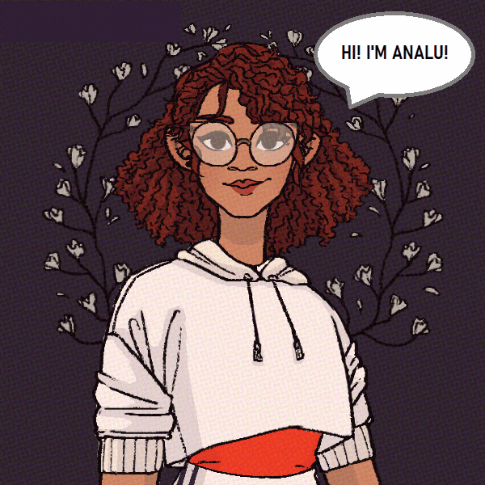

## Olá! Eu sou a Ana Luisa Bandeira ✨

  

  - Ela/dela ♀️
  - Mãe de Maria Flor 👩‍👧
  - Estudo desenvolvimento web através da mentoria @cloudgirls ☁️
  - Aceito ajuda e sugestões de melhorias para os meus códigos 👨‍💻
  - Booklover 📚 
  - Cringe da cabeça aos pés! Fã de Friends 🛋️ e de Harry Potter ⚡, uso emojis nas mensagens e amo café ☕
  - Amo a natureza e gatinhos 😸

## Me encontre em:

 
   
  
  
  
 

## Meu desempenho no GitHub:
 

  
  <a href="https://github.com/analuisabandeira">
   
  </a>
 

 
## Tecnologias em uso:

   
  
  
    

